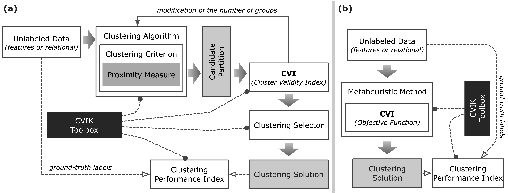

## CVIK Toolbox [`[paper]`](https://www.dropbox.com/s/u098gsxbc9o4kh8/2023-SOFTX-manuscript.pdf?dl=0)

**CVIK** is a Cluster Validity Index toolbox for automatically determining the number of clusters. This toolbox was developed with `MATLAB R2020b` and contains more than 70 functions (m-files), including 28 cluster validity indices (CVIs).

**CVIK** facilitates implementing the entire pipeline of automatic clustering following two approaches: 
+ Evaluating candidate clustering solutions from classical algorithms, in which the number of clusters increases gradually (Fig.a), and 
+ Assessing potential solutions in evolutionary clustering algorithms using single- and multi-objective optimization methods (Fig.b). 

In addition to the CVIs, this toolbox also implements distinct proximity measures to estimate data similarity, and the CVIs are capable of processing both feature data and relational data. 



> **Note** If you use ``CVIK`` as support to your research consider citing:
>
> Adán José-García and Wilfrido Gómez-Flores.
> **CVIK: A Matlab-based Cluster Validity Index Toolbox for Automatic Data Clustering**
> SoftwareX, 2023 | [DOI:10.1016/j.softx.2023.101359](https://www.dropbox.com/s/u098gsxbc9o4kh8/2023-SOFTX-manuscript.pdf?dl=0)

## Software Architecture

The CVIK toolbox implements 28 CVIs and includes other important elements for the automatic data clustering task, such as different proximity measures and external validity indices.


 
## Cluster validity indices (28)

    chindex         - Calinski-Harabasz index (ch).
    cindex          - C index (cind).
    copindex        - COP index (cop).
    csindex         - CS index (cs).
    cvddindex       - Index based on density-involved distance (cvdd).
    cvnnindex       - Index based on nearest neighbors (cvnn).
    dbindex         - Davies-Bouldin index (db).
    db2index        - Enhanced Davies-Bouldin index (db2).
    dbcvindex       - Density-based index (dbcv).
    dunnindex       - Dunn index (dunn).
    gd31index       - Dunn index variant 3,1 (gd31).
    gd33index       - Dunn index variant 3,3 (gd33).
    gd41index       - Dunn index variant 4,1 (gd41).
    gd43index       - Dunn index variant 4,3 (gd43).
    gd51index       - Dunn index variant 5,1 (gd51).
    gd53index       - Dunn index variant 5,3 (gd53).
    lccvindex       - Index based on local cores (lccv).
    pbmindex        - PBM index (pbm).
    sdbwindex       - S_Dbw validity index (sdbw).
    sfindex         - Score Function index (sf).
    silindex        - Silhouette index (sil).
    ssddindex       - Index based on shapes, sizes, densities, and separation distances (ssdd).
    svindex         - SV index (sv).
    symindex        - Symmetry index (sym).
    symdbindex      - Davies-Bouldin index based on symmetry (sdb).
    symdunnindex    - Dunn index based on symmetry (sdi).
    wbindex         - WB index (wb).
    xbindex         - Xie-Beni index (xb).

    cviconfig       - CVI configuration function.
    evalcvi         - CVI evaluation function.


Proximity Measures (8)
-------------------
    eucdist         - Euclidean distance (euc).
    neucdist        - Normalized Euclidean distance (neuc).
    cosdist         - Cosine similarity (cos).
    pcorr           - Pearson's correlation coefficient (pcorr).
    scorr           - Spearman's correlation coefficient (scorr).
    lapdist         - Laplacian distance (lap).
    symdist         - Symilarity-based distance (sym).
    medist          - Maxium Edge distance (med).

    proxconfig      - Proximity configuration function


Clustering Algorithms (4)
------------------
    kmedoids        - K-medoids clustering algorithm.
    acde            - An automatic clustering algorithm based on differential evolution.
    tgca            - A two-stage genetic clustering algorithm.
    depso           - An automatic clustering algorithm based on particle swarm optimization.


Clustering Performance Indices (14)
-------------------
    inftheoryindex  - External validity indices based on information theory:
        - Mutual information (mi).
        - Variation of information (vi).
        - Normalized mutual information (nvi).

    pairwiseindex   - External validity indices based on pairwise similarity:
        - Rand index (ri).
        - Adjusted rand index (ari).
        - Wallace coefficient A->B (wab).
        - Wallace coefficient B->A (wba).
        - Jaccard index (jrd).
        - Fowlkes-Mallows index (fm).
        - Larsen index A->B (lab).
        - Larsen index B->A (lba).
        - Meila-Heckerman index (mh).
        - Mirkin coefficient (mc).


## Contact:

```
Adán José-García (adan.jose@cinvestav.mx)
Wilfrido Gómez-Flores (wgomez@cinvestav.mx)
```

## Citation:

If you find our repository and toolbook helpful to your research, please cite our [`paper`](https://www.dropbox.com/s/u098gsxbc9o4kh8/2023-SOFTX-manuscript.pdf?dl=0):
```
@article{JoseGarciaGF23,
    author    = {Adán {José-García} and
                 Wilfrido {Gómez-Flores}},
    title     = {CVIK: A Matlab-based Cluster Validity Index Toolbox for Automatic Data Clustering},
    journal   = {SoftwareX},
    doi       = {doi.org/10.1016/j.softx.2023.101359},
    year      = {2023}
}
```
